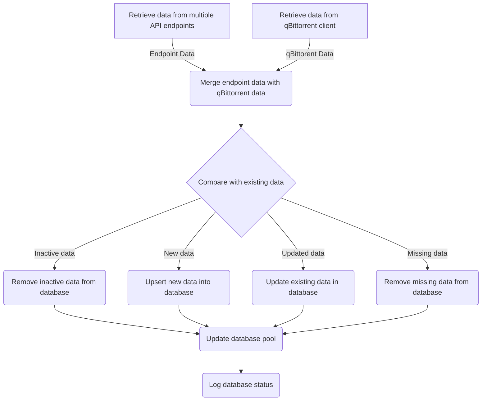
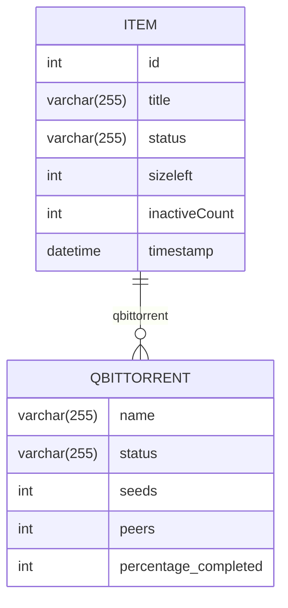

```mermaid
graph TD;
    A[Retrieve data from multiple API endpoints] --> |Endpoint Data|B(Merge endpoint data with qBittorrent data);
    O[Retrieve data from qBittorrent client] --> |qBittorent Data|B;
    B --> C{Compare with existing data};
    C --> |New data| D(Upsert new data into database);
    C --> |Updated data| E(Update existing data in database);
    C --> |Missing data| F(Remove missing data from database);
    C --> |Inactive data| G(Remove inactive data from database);
    G --> H(Update database pool);
    D --> H;
    E --> H;
    F --> H;
    H --> N(Log database status);
```

```mermaid
erDiagram
    ITEM {
        int id
        varchar(255) title
        varchar(255) status
        int sizeleft
        int inactiveCount
        datetime timestamp
    }
    QBITTORRENT {
        varchar(255) name
        varchar(255) status
        int seeds
        int peers
        int percentage_completed
    }
    ITEM ||--o{ QBITTORRENT : qbittorrent
```