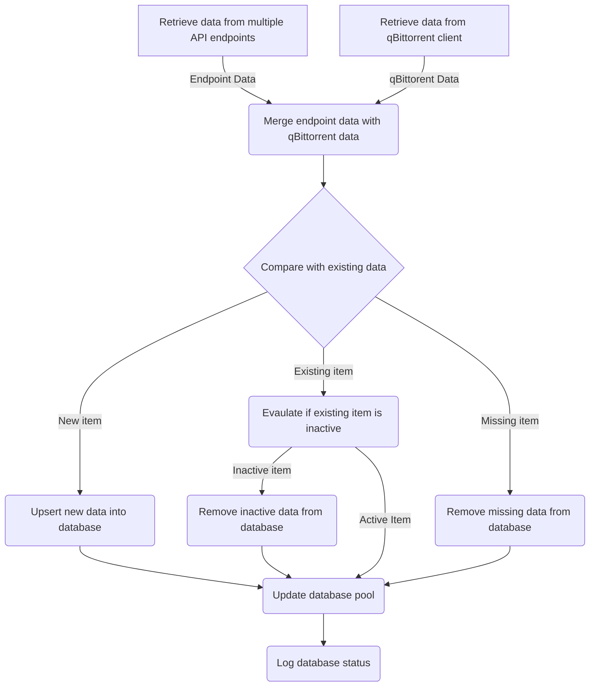
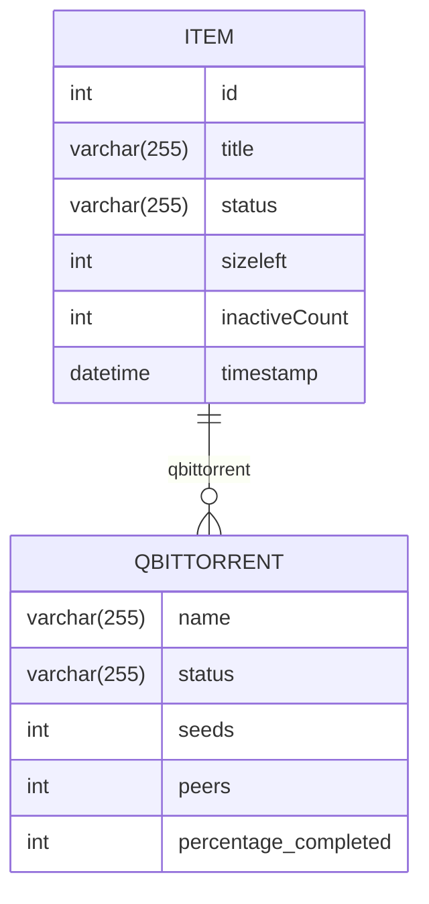

```mermaid
graph TD;
    A[Retrieve data from multiple API endpoints] --> |Endpoint Data|B(Merge endpoint data with qBittorrent data);
    J[Retrieve data from qBittorrent client] --> |qBittorent Data|B;
    B --> C{Compare with existing data};
    C --> |New item| D(Upsert new data into database);
    C --> |Existing item| E(Evaulate if existing item is inactive);
    C --> |Missing item| F(Remove missing data from database);
    E --> |Inactive item| G(Remove inactive data from database);    
    D --> H;    
    E --> |Active Item| H;
    F --> H;
    G --> H(Update database pool);
    H --> I(Log database status);
```

```mermaid
erDiagram
    ITEM {
        int id
        varchar(255) title
        varchar(255) status
        int sizeleft
        int inactiveCount
        datetime timestamp
    }
    QBITTORRENT {
        varchar(255) name
        varchar(255) status
        int seeds
        int peers
        int percentage_completed
    }
    ITEM ||--o{ QBITTORRENT : qbittorrent
```