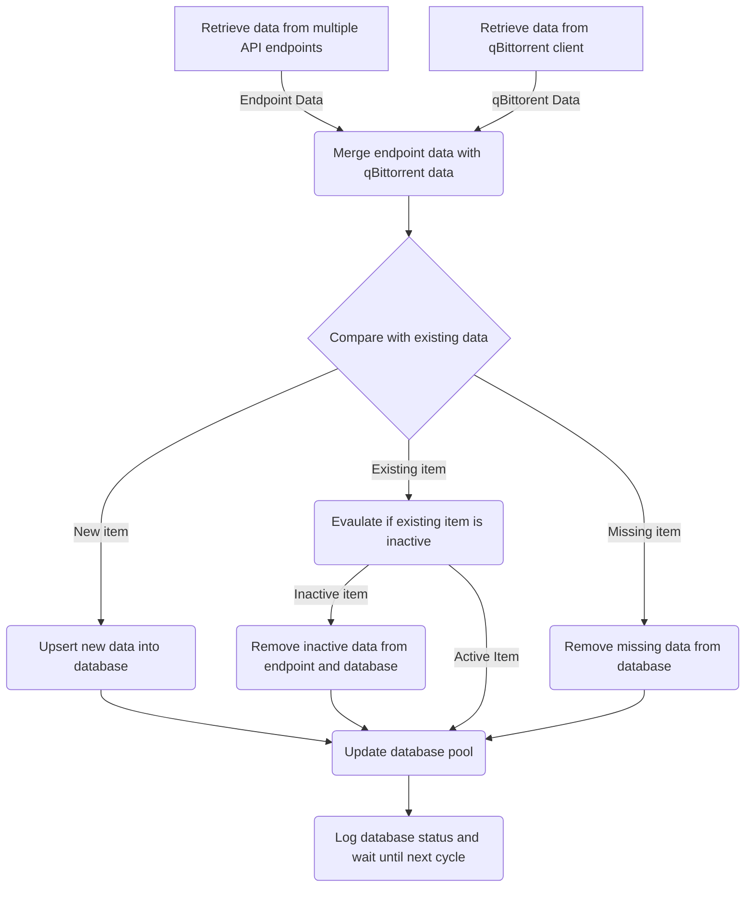
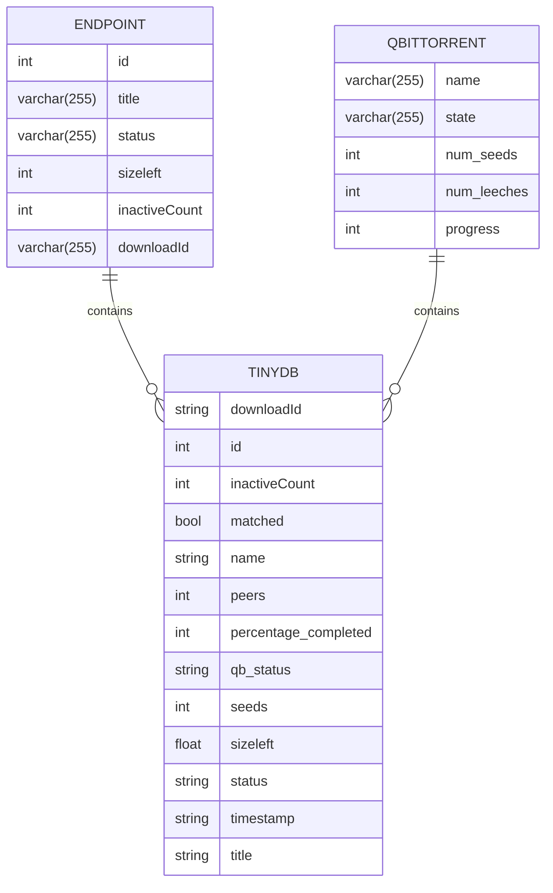

# TidyArr

Don't let stalled downloads slow you down. With TidyArr, you can automate the process of removing inactive items from your *Arr endpoints to keep your downloads tidy.

## Table of Contents

- [TidyArr](#tidyarr)
  - [Table of Contents](#table-of-contents)
  - [Features](#features)
  - [Description](#description)
    - [Developer Notes](#developer-notes)
    - [How we calculate inactivity](#how-we-calculate-inactivity)
      - [Ways to increase the inactivity counter](#ways-to-increase-the-inactivity-counter)
      - [Ways to decrease the inactivity counter](#ways-to-decrease-the-inactivity-counter)
  - [Getting Started](#getting-started)
  - [Environment Variables](#environment-variables)
    - [Endpoint environment variables](#endpoint-environment-variables)
    - [qBittorrent environment variables](#qbittorrent-environment-variables)
    - [Example .env File Configuration](#example-env-file-configuration)
  - [Obligatory Diagrams](#obligatory-diagrams)
    - [Flowchart of how items are processed](#flowchart-of-how-items-are-processed)
    - [Item schema stored in TinyDB](#item-schema-stored-in-tinydb)
  - [Contributing](#contributing)
    - [Reporting Bugs](#reporting-bugs)
    - [Submitting Feature Requests](#submitting-feature-requests)
    - [Submitting Code Changes](#submitting-code-changes)
  - [Credits](#credits)
  - [License](#license)

## Features

- Monitors torrents added to qBittorrent by Radarr and Sonarr
- Removes items identified as inactive torrents
- Tells the \*Arr endpoint that the item has failed.  If the \*Arr endpoint is configured properly, then a different copy will be added to be acquired
- Uses weighted scoring and a snowball effect to determine which items should be removed
- Stores the state of the script in a TinyDB JSON file
- Logs the decisions the script is making for debugging
- Uses environment variables to set the:
  - hostname or IP address, port, username, and password of the qBittorrent API
  - URL and API key for any number of *Arr endpoints
  - optional customization of the script interval, inactive threshold, and log level

## Description

TidyArr is a Python script that helps you manage your torrents in qBittorrent. It works with Radarr and Sonarr to remove torrents that are not actively downloading. When TidyArr identifies an inactive torrent, it will tell Radarr or Sonarr that the item has failed. If Radarr or Sonarr is set up to redownload a new torrent when an item fails, it will do so.

Inactive torrents are defined as items that are not actively downloading.  We use conditions to check for these items, and use weighted scoring and a snowball effect to determine which items should be removed.

### Developer Notes

This is passion project to learn Python and solve some challenges I've encountered.  I searched for a long time for a good script that removed stalled downloads, but they either didn't have a means of accumulating inactivity, or didn't have a way to decay the inactivity if a torrent became available.  I presume this will work with any of the \*arr apps, but I've only personally tested it on Radarr and Sonarr.

I'm sure there's better variables to monitor, different weights to apply and perhaps a more robust way of calculating inactivity - but this has been _good'nuff_ for me.  

I'll probably continue tinkering - since that's who I am - but largely this is as is for now.  I can make a list of wish list items, but I don't expect to achieve all or any of them anytime soon.

- [ ] Add unit testing for testing resiliency
- [X] Change inactivity formula to account for current progress and minimize the hit to the inactivity if the download is near completion.
- [ ] Add additional torrent client support
- [ ] Build this script into a Docker container
- [ ] Revisit all logging output to ensure standardization
- [ ] Create a way to capture torrent metrics for use in ML training
- [ ] Experiment with ML to determine a better growth and decay formula
- [ ] Build a ML model that can predict if a download is likely to finish
- [ ] Auto-Updater

### How we calculate inactivity

#### Ways to increase the inactivity counter

1. If the qbittorrent status is stalledDL and the sizeleft has not changed
2. If the qbittorrent status is stalledDL and has peers with a value of 0
3. If the qbittorrent status is stalledDL and has seeds with a value of 0
4. If the qbittorrent status is stalledDL and the availability is less than 0.1
5. If the qbittorrent status is "metaDL"
6. If the qbittorrent filesize is the same as the previous filesize, start to snowball the inactivity counter by multiplying it by 1.05

We then take the difference between the original inactive count and the updated inactive count - and reduce the updated count by the % that the file is completed.

#### Ways to decrease the inactivity counter

1. If the existing item has an inactiveCount above 1, and the sizeleft has changed, then we halve the inactiveCounter.

If an item's inactiveCounter is greater than or equal to the INACTIVE_THRESHOLD, then we add it to the inactive_items list.

## Getting Started

1. Clone the TidyArr repository from GitHub:

    ```code
    git clone https://github.com/czer323/tidyarr.git
    ```

2. Install the required dependencies by running the following command in the root directory of the cloned repository:

    ```code
    pip install -r requirements.txt
    ```

3. Set the required environment variables as described in the README file. You can set these environment variables using the command line or by adding them to a `.env` file in the root directory of the script.

    💡 **`TIP`**
    You can get an example copy from this repo: <https://www.github.com/czer323/TidyArr/TidyArr/.env.example>

4. Run the TidyArr script by running the following command in the root directory of the script:

    ```code
    python tidyarr.py
    ```

> 📝 **`Info`**
>If there are any problems during execution, you can change the log level to debug and review the log: TidyArr.log which should be saved in the same directory as the script.

## Environment Variables

The following environment variables must be set:

### Endpoint environment variables

> 💡 **`Note`**
> Endpoint items are special because we can add as many endpoints as we need. We use the naming convention "ENDPOINT_{name}_URL" and "ENDPOINT_{name}_API_KEY" to specify the URL and API key for each endpoint.

| Environment Variable | Description |
| --- | --- |
| `ENDPOINT_{name}_URL` | The URL of the Sonarr or Radarr endpoint with the name `{name}`. |
| `ENDPOINT_{name}_API_KEY` | The API key for the Sonarr or Radarr endpoint with the name `{name}`. |

### qBittorrent environment variables

| Environment Variable | Description |
| --- | --- |
| `QB_HOSTNAME` | The hostname or IP address of the qBittorrent API. |
| `QB_PORT` | The port of the qBittorrent API. |
| `QB_USERNAME` | The username of the qBittorrent API. |
| `QB_PASSWORD` | The password of the qBittorrent API. |

The following environment variables can optionally be set:

| Environment Variable | Description | Default Value |
| --- | --- | --- |
| `SCRIPT_INTERVAL` | The interval at which the script should run, in seconds. | `600` |
| `INACTIVE_THRESHOLD` | The number of inactivity points an item must have before it is removed. | `72` |
| `LOG_LEVEL` | The log level to use. `WARNING` events are all related to items being inactive.  To see general details of all items, change this to `INFO`.  To see all JSON parsing and filtering, you can change this to `DEBUG`. | `WARNING` |

### Example .env File Configuration

```code
# Radarr endpoint URL and API key
ENDPOINT_RADARR_URL=http://your-radarr-url.com:7878
ENDPOINT_RADARR_API_KEY=your-radarr-api-key

# Sonarr endpoint URL and API key
ENDPOINT_SONARR_URL=http://your-sonarr-url.com:8989
ENDPOINT_SONARR_API_KEY=your-sonarr-api-key

# QBittorrent settings
QB_HOSTNAME=your-qbittorrent-hostname.com
QB_PORT=7878
QB_USERNAME=your-qbittorrent-username
QB_PASSWORD=$up3r$3cr3t

# Script settings (Optional)
SCRIPT_INTERVAL=600
INACTIVE_THRESHOLD=72
LOG_LEVEL=WARNING
```

## Obligatory Diagrams

### Flowchart of how items are processed



### Item schema stored in TinyDB



## Contributing

Thank you for considering contributing to this project! Please follow the guidelines below to ensure a smooth contribution process.

### Reporting Bugs

If you find a bug, please open an issue on the project's GitHub repository. Please include a clear and detailed description of the bug, steps to reproduce it, and any relevant screenshots or error messages.

### Submitting Feature Requests

If you have an idea for a new feature or improvement, please open an issue on the project's GitHub repository. Please include a clear and detailed description of the feature, why it would be useful, and any relevant examples or use cases.

### Submitting Code Changes

If you would like to contribute code changes, please follow these steps:

1. Fork the project's GitHub repository.
2. Create a new branch for your changes.
3. Make your changes and commit them with clear and concise commit messages.
4. Push your changes to your forked repository.
5. Open a pull request on the project's GitHub repository, with a clear and detailed description of your changes.

Please note that all contributions will be reviewed by the project maintainers, and may be rejected or require changes before being merged. By contributing to this project, you agree to abide by the project's code of conduct.

## Credits

This project was inspired by and built upon the work of the developers of Radarr, Sonarr, Lidarr and all the other *arr programs. We would like to thank them for their hard work and dedication to creating open-source software that makes managing media collections easier and more enjoyable.

We would also like to thank the many contributors to these projects, who have helped to improve and maintain them over the years. Without their hard work and dedication, this project would not be possible.

Thank you to all the developers and contributors who have made the *arr ecosystem what it is today!

## License

- [GPL3](https://www.gnu.org/licenses/gpl-3.0.html)
- Copyright 2023
